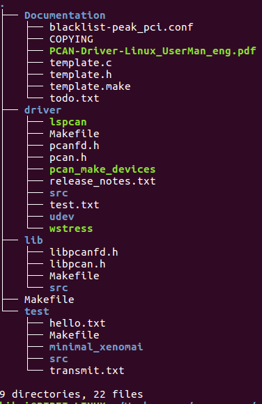
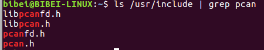
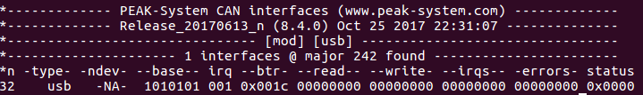

# Prerequisites
  PCAN-BASIC is a simple driver for pcan devices. The PcanChannel class use PCAN-BASIC library for reading, processing and writing Packet from can bus. Download and install instructions can be found at:
  [peak-linux-driver](http://www.peak-system.com/fileadmin/media/linux/files/peak-linux-driver-8.4.0.tar.gz)
  **and**
  [PCAN-Basic-Linux](http://www.peak-system.com/produktcd/Develop/PC%20interfaces/Linux/PCAN-Basic_API_for_Linux/PCAN_Basic_Linux-4.1.1.tar.gz)

  We have tested the library in **Ubuntu 16.04** on the PC and **Ubuntu mate 16.04** on the Raspberry Pi3.

# Install peak-linux-driver

## Ubuntu 16.04
  1. Open a termial, and type:
  
    ```sh
    sudo apt-get install libpopt-dev
    ```
  2. Download the peak-linux-driver. The result as folllow:
  <center>
  
  </center>
  3. Type the command in the terminal

  ```sh
  cd /path/to/peak_linux_driver
  make clean
  make
  sudo make install
  ```

## Ubuntu mate 16.04
  Open a terminal, and type:

  ```sh
  sudo apt-get install raspberrypi-kernel-headers 
  cd /path/to/peak_linux_driver
  make
  sudo make install
  sudo modprobe pcan
  ```

  **The follow of operation is Deprecated.**
  >1. The ubuntu mate 16.04 on the raspberry pi3 is missing the linux-hearder, so we need to install the linux-hearder firstly. Type the command to veritify the version of linux-hearder.
  ```sh
  echo $(uname -r)
  ```
  >2. Install linux-hearder
    >1. Downloading the correct version from this [webset](https://www.niksula.hut.fi/~mhiienka/Rpi/linux-headers-rpi/), and installing it with
    ```sh
    sudo dpkg -i /path/to/linux-hearders-xxx_xxx_armhf.deb
    ```
    >2. Installing the linux-header by Raspberry Pi kernel source installer (more detail see [wiki](https://github.com/notro/rpi-source/wiki)), This method comes from [the peak-system forum](http://www.peak-system.com/forum/viewtopic.php?f=59&t=283&start=90#p5327), and without practice.
    ```sh
    git clone https://github.com/notro/rpi-source
    cd rpi-source
    chmod +x rpi-source
    sudo apt-get install bc
    ./rpi-source
    ```
  >3. Open a termial, and type:
    ```sh
    sudo apt-get install libpopt-dev
    cd /path/to/peak_linux_driver
    make clean
    sudo make PCI=NO PCIEC=NO PCC=NO DNG=NO PAR=NO ISA=NO
    sudo make install
  ```

## Verification
  Type the command as follow, and you should end up with something similar to what I have below.
  ```sh
  ls /usr/include | grep pcan*
  ```
  <center>
  
  </center>
  And, type this command:
  ```sh
  cat /proc/pcan
  ```
  the result as follow.
  <center>
  
  </center> 

# Install pcan-basic
  1. Download the PCAN-Basic-Linux.
  2. Open a terminal, and type
  ```sh
  cd /path/to/PCAN_Basic_Linux/pcanbasic
  make
  sudo make install
  ```